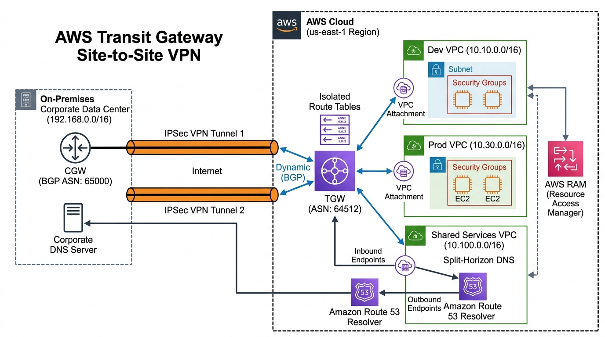

# Hybrid Cloud Connectivity with AWS Transit Gateway & Site-to-Site VPN

[](https://aws.amazon.com/transit-gateway/)
[](https://aws.amazon.com/vpn/)
[](https://aws.amazon.com/route53/)
[](LICENSE)

An enterprise hub-and-spoke hybrid network architecture connecting on-premises data centers to AWS through **AWS Transit Gateway** and **IPSec Site-to-Site VPN with BGP routing**. Features multi-VPC segmentation (Dev, Staging, Prod), centralized traffic inspection, split-horizon DNS through **Amazon Route 53 Resolver Endpoints**, and cross-account transit sharing with **AWS Resource Access Manager (RAM)**.

---

## Table of Contents

- [Solution Overview](#solution-overview)
- [Architecture Diagram](#architecture-diagram)
- [AWS Services Used & Why](#aws-services-used--why)
- [IP Addressing & CIDR Allocation Plan](#ip-addressing--cidr-allocation-plan)
- [Direct Connect vs Site-to-Site VPN Comparison](#direct-connect-vs-site-to-site-vpn-comparison)
- [Design Decisions & Well-Architected Trade-offs](#design-decisions--well-architected-trade-offs)
- [Cost Estimation & Optimization](#cost-estimation--optimization)

---

## Solution Overview

As enterprises migrate workloads to the cloud, mesh VPC peering topologies become unmanageable (requiring $N(N-1)/2$ peering connections). Furthermore, on-premises applications require seamless, bi-directional private DNS resolution to query AWS workloads without public internet exposure.

This architecture delivers:
- **Centralized Hub-and-Spoke Topology**: An AWS Transit Gateway acts as a high-throughput cloud router (up to 50 Gbps per VPC attachment) consolidating connections across Dev, Staging, and Production VPCs.
- **Dynamic Routing via BGP**: Dual IPSec VPN tunnels run Border Gateway Protocol (BGP ASN 64512 AWS, ASN 65000 On-Prem) with automated path failover and route propagation.
- **Bi-Directional Split-Horizon DNS**: Route 53 Resolver Inbound endpoints allow on-premises servers to resolve `*.aws.internal` records; Outbound endpoints forward `*.corp.internal` lookups to corporate DNS servers.
- **Traffic Isolation & Route Segmentation**: Dedicated TGW Route Tables ensure Dev VPC cannot communicate with Prod VPC, while both maintain controlled access to on-premises resources.

---

## Architecture Diagram



<details>
<summary>Click to view Mermaid diagram markup</summary>

```mermaid
flowchart TB
    subgraph OnPrem ["On-Premises Corporate Data Center (192.168.0.0/16)"]
        CGW["Customer Gateway (CGW)\nPublic IP: 203.0.113.10\nBGP ASN: 65000"]
        CorporateDNS["Corporate DNS Server\nIP: 192.168.1.10\nDomain: corp.internal"]
        OnPremServers["Legacy Database / ERP\nSubnet: 192.168.10.0/24"]
    end

    subgraph AWSCloud ["AWS Cloud (us-east-1)"]
        subgraph TGWHub ["Transit Gateway Hub (ASN: 64512)"]
            TGW["AWS Transit Gateway"]
            RT_Spoke["Spoke TGW Route Table"]
            RT_OnPrem["On-Prem TGW Route Table"]
        end

        subgraph VPC_Dev ["Development VPC (10.10.0.0/16)"]
            DevSubnet["Dev Compute (10.10.1.0/24)"]
            DevTransitSub["TGW Subnet (10.10.254.0/28)"]
        end

        subgraph VPC_Prod ["Production VPC (10.30.0.0/16)"]
            ProdSubnet["Prod Workloads (10.30.1.0/24)"]
            ProdTransitSub["TGW Subnet (10.30.254.0/28)"]
        end

        subgraph VPC_Shared ["Shared Services VPC (10.100.0.0/16)"]
            subgraph DNSResolver ["Route 53 Resolver Endpoints"]
                InboundEP["Inbound Endpoint\nIP: 10.100.1.10\nResolves *.aws.internal"]
                OutboundEP["Outbound Endpoint\nForwards *.corp.internal\nto 192.168.1.10"]
            end
            SharedTransitSub["TGW Subnet (10.100.254.0/28)"]
        end
    end

    %% VPN IPSec Tunnels
    CGW <==>|IPSec Tunnel 1 (Active BGP)| TGW
    CGW <==>|IPSec Tunnel 2 (Standby BGP)| TGW

    %% TGW Attachments
    TGW --- DevTransitSub
    TGW --- ProdTransitSub
    TGW --- SharedTransitSub

    %% DNS Flows
    CorporateDNS -->|1. Forward *.aws.internal queries| InboundEP
    InboundEP -->|2. Query Private Hosted Zone| DevSubnet & ProdSubnet
    ProdSubnet -->|3. Resolve *.corp.internal| OutboundEP
    OutboundEP -->|4. Forward DNS Query via VPN| CorporateDNS
```
</details>

> **Note**: A vector format source file (`architecture.drawio`) is included in this directory. You can open and edit it in [draw.io](https://app.diagrams.net/) or [Lucidchart](https://lucid.app/).

---

## AWS Services Used & Why

| Service | Role in Architecture | Why We Chose This Service |
|---|---|---|
| **AWS Transit Gateway (TGW)** | Central Cloud Router | Replaces complex point-to-point mesh VPC peering ($N(N-1)/2$ links) with a scalable hub-and-spoke model. Supports route table segmentation to isolate development and production environments while sharing on-premises connections. |
| **AWS Site-to-Site VPN** | Encrypted Hybrid Connectivity | Establishes dual IPSec tunnels over the public internet with BGP dynamic routing, providing rapid, cost-effective hybrid connectivity without the multi-week lead times of physical circuits. |
| **Amazon Route 53 Resolver** | Split-Horizon DNS Resolution | Provides managed Inbound and Outbound DNS endpoints across multiple Availability Zones, allowing seamless bi-directional resolution between corporate internal domains (`*.corp.internal`) and AWS private hosted zones (`*.aws.internal`) without self-hosted DNS forwarders. |
| **AWS Resource Access Manager (RAM)** | Multi-Account Network Sharing | Allows the Transit Gateway owned by a centralized Network / Shared Services AWS account to be shared securely across member accounts (Dev, Prod), standardizing governance. |
| **Amazon VPC & Dedicated Transit Subnets** | Network Segmentation & Attachment Isolation | Isolates workload tiers into dedicated environments and utilizes small `/28` transit subnets exclusively for Transit Gateway elastic network interfaces to eliminate route table recursion loops. |
| **Amazon CloudWatch** | Tunnel & Route Monitoring | Tracks VPN state, tunnel health metrics, bytes in/out, and BGP session status with automated alerting on degraded connectivity. |

---

## IP Addressing & CIDR Allocation Plan

To prevent routing conflicts across cloud and on-premises environments, a non-overlapping IP layout is allocated:

| Network Segment | Environment | CIDR Block | Transit Subnet (`/28`) | BGP ASN |
|---|---|---|---|:---:|
| **On-Premises Data Center** | Corporate HQ | `192.168.0.0/16` | N/A | 65000 |
| **Dev VPC** | AWS Dev Account | `10.10.0.0/16` | `10.10.254.0/28` | 64512 (TGW) |
| **Staging VPC** | AWS Stage Account| `10.20.0.0/16` | `10.20.254.0/28` | 64512 (TGW) |
| **Prod VPC** | AWS Prod Account | `10.30.0.0/16` | `10.30.254.0/28` | 64512 (TGW) |
| **Shared Services VPC** | Core Network | `10.100.0.0/16`| `10.100.254.0/28` | 64512 (TGW) |

> **Best Practice (Dedicated Transit Subnets)**: Always create small dedicated subnets (`/28`) exclusively for Transit Gateway ENI attachments. Do not place EC2 instances or load balancers in these subnets to avoid routing table recursion loops.

---

## Direct Connect vs Site-to-Site VPN Comparison

When planning enterprise cloud connectivity, evaluate these design parameters:

| Criteria | AWS Site-to-Site VPN | AWS Direct Connect (DX) |
|---|---|---|
| **Transmission Medium** | Encrypted IPSec tunnels over Public Internet | Dedicated physical fiber link (Private 802.1Q VLAN) |
| **Bandwidth Capacity** | Up to 1.25 Gbps per tunnel (ECMP can scale to ~10 Gbps) | 1 Gbps, 10 Gbps, or 100 Gbps dedicated ports |
| **Latency / Jitter** | Subject to internet routing fluctuations | Deterministic, consistent, ultra-low latency |
| **Provisioning Time** | Under 30 minutes | 3 to 12 weeks (requires physical telecom cross-connect) |
| **Monthly Cost Profile** | ~$36/mo per connection + data egress | ~$150-$2,500+/mo port fee + dedicated circuit costs |
| **Recommended Use Case** | Capstones, dev/test, or backup link to DX | Enterprise mission-critical production with > 1 Gbps sustained egress |

---

## Design Decisions & Well-Architected Trade-offs

| Decision | Trade-Off & Technical Rationale |
|---|---|
| **BGP Dynamic Routing over Static Routes** | BGP continuously monitors tunnel health using keepalives. If Tunnel 1 fails, traffic automatically reconverges to Tunnel 2 in seconds without human manual route table updates. |
| **TGW Route Table Isolation** | Dev and Prod VPCs are attached to the same TGW but associated with isolated TGW route tables. This enforces zero trust network segmentation without needing expensive physical firewalls. |
| **Route 53 Resolver Endpoints** | Eliminates maintaining custom Bind9 DNS forwarders on EC2 instances. Route 53 Resolver is a fully managed, multi-AZ native service scaling up to 10,000 queries per second per IP. |
| **AWS RAM for Multi-Account Governance** | Centralizes network ownership in a designated Networking Account. Member accounts receive TGW attachments via RAM without needing administrative privileges to alter routing rules. |

---

## Cost Estimation & Optimization

| AWS Service | Configuration Details | Estimated Monthly Cost |
|---|---|:---:|
| **AWS Transit Gateway** | 1 TGW + 3 VPC Attachments ($0.05/attachment/hr) | ~$108.00 |
| **AWS Site-to-Site VPN** | 1 Connection, 2 Tunnels ($0.05/hr) | ~$36.00 |
| **Route 53 Resolver Endpoints** | 2 Inbound + 2 Outbound Elastic ENIs ($0.125/hr/ENI) | ~$72.00 |
| **Data Processing (TGW & VPN)** | 50 GB Data Processed ($0.02/GB) | ~$1.00 |
| **Total Estimated Cost** | **Production Hub-and-Spoke Configuration** | **~$217.00 / month** |

> **Cost Optimization Tip for Testing**: Delete TGW attachments and VPN connections when not actively testing to incur only pennies per demonstration hour.
